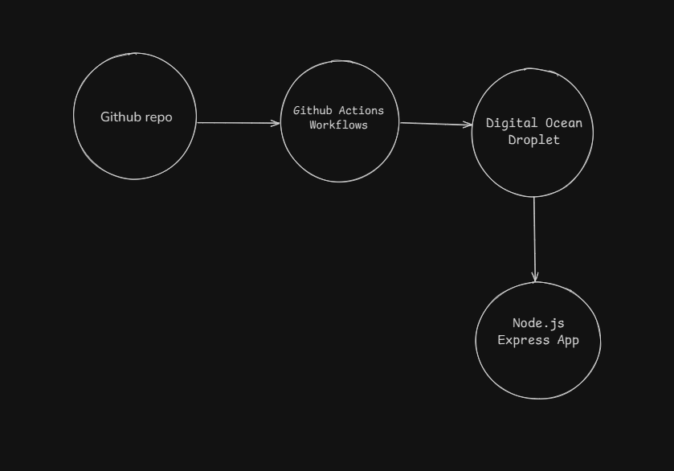
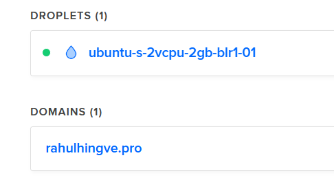
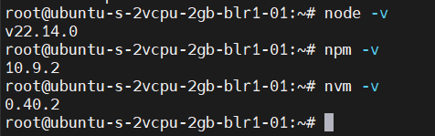
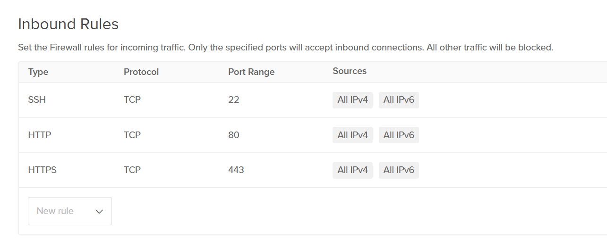
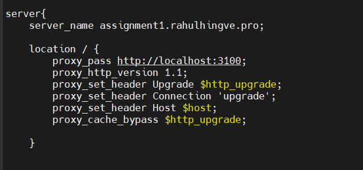
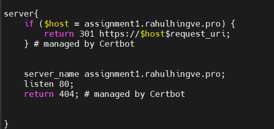

# 1. Cloud Infrastructure & Deployment

I chose to deploy my application on a Digital Ocean droplet instead of Azure (hope that's okay!). I went with DO primarily because I was having trouble getting my Azure account set up, and I already had some credits left on Digital Ocean that I wanted to use. This seemed like a practical alternative that would allow me to demonstrate the same DevOps concepts without getting blocked by account setup issues.

## Architecture Diagram




## My Setup

I've created a simple architecture:
- GitHub repo for version control
- GitHub Actions for CI/CD 
- Digital Ocean droplet (Ubuntu) for hosting
- Express.js for the web application

## Deployment Steps

Here's how I deployed everything:

1. Used an existing DO droplet with Ubuntu (2GB RAM, 2 CPU)
   - You can see my Digital Ocean droplet configuration in the screenshot below
    
   - Located in the Bangalore region for lower latency since I'm in India
   - SSH key was already configured for secure access

2. Set up SSH access using key authentication
   - Generated SSH key pair locally with `ssh-keygen`
   - Added public key to authorized_keys on server
   - Disabled password authentication in `/etc/ssh/sshd_config`
   - Restarted SSH service with `systemctl restart sshd`

3. Installed Node.js using NVM
   
   ```bash
   
      root@ubuntu-s-2vcpu-2gb-blr1-01:~# node -v
      v22.14.0
      root@ubuntu-s-2vcpu-2gb-blr1-01:~# npm -v
      10.9.2
      root@ubuntu-s-2vcpu-2gb-blr1-01:~# nvm -v
      0.40.2
      root@ubuntu-s-2vcpu-2gb-blr1-01:~#


   ```
   


4. Installed PM2 for process management
   ```bash
   npm install -g pm2
   pm2 startup  # Generate the startup script
   ```

5. Created a simple Express.js application
   ```bash
   mkdir -p ~/Assignment/DevOps-Asignment
   cd ~/Assignment/DevOps-Asignment
   npm init -y
   npm install express
   ```

6. Set up a basic web server (index.js)
   ```javascript
   const express = require("express");
   const app = express();
   
   app.get("/", (req, res) => {
     res.send("Hello From Digital Ocean Server Coz mine azure free tier expired🥲<br>A small change to test the deployment");
   });
   
   app.listen(3100, () => {
     console.log("Server is running on port 3100");
   });
   ```

7. Started the application with PM2
   ```bash
   pm2 start index.js
   pm2 save  # Save the process list
   ```

## Digital Ocean Configuration

I used the following configuration for my Digital Ocean droplet:
- OS: Ubuntu 24.10 LTS
- Plan: Basic Shared CPU, 2GB RAM / 2 CPU
- Region: BLR1 (Bangalore)
- Authentication: SSH Key only
- Firewall: Allowed ports 22 (SSH), 80 (HTTP), 443 (HTTPS)
 

## Domain and SSL Configuration

I've set up a custom domain for the application to make it more professional:

1. Registered the domain and pointed it to the Digital Ocean nameservers
2. Created an A record pointing to the droplet IP address
3. Set up Nginx as a reverse proxy to forward requests to the Node.js application

To secure the connection with HTTPS, I installed an SSL certificate using Certbot:

   

   cerbot
   

You can access the live application at [https://assignment1.rahulhingve.pro/](https://assignment1.rahulhingve.pro/) 