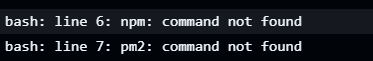

# 2. CI/CD Pipeline Implementation

For the CI/CD pipeline, I went with GitHub Actions since it integrates perfectly with the repo. The workflow is pretty simple but effective.

## Pipeline Overview

The CI/CD pipeline process follows these steps:

1. Code gets pushed to the main branch
2. GitHub Actions triggers the workflow automatically
3. Files are copied to the server using SCP (Secure Copy)
4. The application is restarted using PM2

This setup ensures that every time I push changes to the main branch, my application is automatically updated on the server without any manual intervention.

## Pipeline Configuration

Here's my GitHub Actions workflow file (`.github/workflows/deploy.yml`):
```yaml
name: Deploy to DO

on:
  push:
    branches:
      - main

jobs:
  deploy:
    runs-on: ubuntu-latest

    steps:
      - name: Checkout code
        uses: actions/checkout@v3

      - name: Copy files via SSH
        uses: appleboy/scp-action@master
        with:
          host: ${{ secrets.DO_HOST }}
          username: root
          key: ${{ secrets.DO_SSH_KEY }}
          source: "."
          target: "/root/Assignment/DevOps-Asignment"

      - name: Deploy and restart app
        uses: appleboy/ssh-action@master
        with:
          host: ${{ secrets.DO_HOST }}
          username: root
          key: ${{ secrets.DO_SSH_KEY }}
          script: |
            export NVM_DIR="$HOME/.nvm"
            [ -s "$NVM_DIR/nvm.sh" ] && \. "$NVM_DIR/nvm.sh"
            [ -s "$NVM_DIR/bash_completion" ] && \. "$NVM_DIR/bash_completion"
            cd /root/Assignment/DevOps-Asignment
            pm2 stop index
            npm install
            pm2 start index
```

## GitHub Actions Workflow in Action

Below is a screenshot of the GitHub Actions workflow running successfully:


This screenshot shows the CI/CD pipeline in action, demonstrating that the automated deployment process is working as expected. The green checkmarks indicate that all steps in the workflow completed successfully.


## Pipeline Stages Explanation

1. **Checkout Stage**:
   - Uses the `actions/checkout@v3` action to clone the repository
   - Makes the codebase available for the next steps in the pipeline

2. **Copy Files Stage**:
   - Uses the `appleboy/scp-action@master` to securely copy files
   - Transfers all files from the repository to the target server
   - Uses SSH key authentication for secure access

3. **Deploy and Restart Stage**:
   - Uses the `appleboy/ssh-action@master` to run commands on the remote server
   - Sets up the Node.js environment by sourcing NVM
   - Navigates to the project directory
   - Stops the application if it's running
   - Installs dependencies with `npm install`
   - Starts the application with PM2

## Secrets and Environment Variables Management

I'm storing all sensitive information like SSH keys and host details as GitHub Secrets. This way, they're encrypted and not visible in the repository or logs.

GitHub Secrets I've set up:
- `DO_HOST`: The IP address of my Digital Ocean droplet
- `DO_SSH_KEY`: The private SSH key for authentication

To set up these secrets:
1. Went to repository Settings
2. Selected "Secrets and variables" → "Actions"
3. Added the secrets using the "New repository secret" button

This approach ensures that sensitive information is not hardcoded in the workflow file and is securely managed by GitHub.

## Challenges and Solutions

One challenge I faced was that the SSH session wasn't loading the NVM environment properly, causing "command not found" errors for npm and PM2. I solved this by adding the following lines to explicitly load NVM:

### Error



### Solution
```bash
export NVM_DIR="$HOME/.nvm"
[ -s "$NVM_DIR/nvm.sh" ] && \. "$NVM_DIR/nvm.sh"
[ -s "$NVM_DIR/bash_completion" ] && \. "$NVM_DIR/bash_completion"
```

This ensures that the Node.js environment is properly loaded before running any Node.js related commands. 
