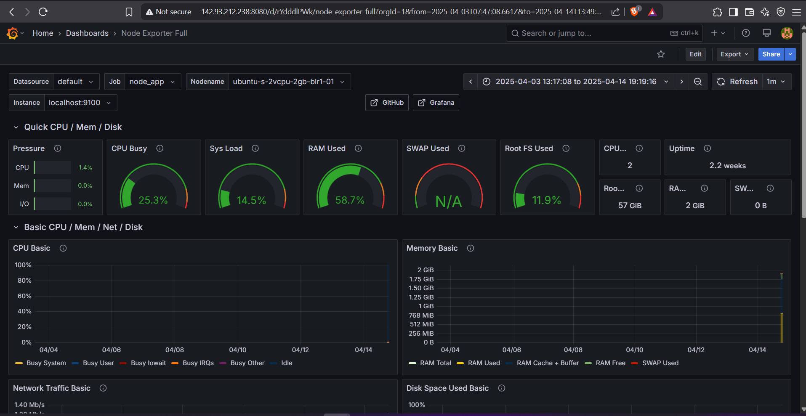

# 4. Monitoring & Logging

For monitoring and logging, I set up a basic but effective system based primarily on PM2 and custom logging. With more time, I would have implemented a full Prometheus/Grafana stack, but the current setup provides good visibility into application performance and issues.

## Monitoring Setup

### PM2 Monitoring

I used PM2 (Process Manager 2) for basic application monitoring:

1. **Installation**:
   ```bash
   npm install -g pm2
   ```

2. **Configuration**:
   ```bash
   # Start the application with PM2
   pm2 start index.js
   
   # Enable startup script to auto-start PM2 on server reboot
   pm2 startup
   
   # Save the current process list
   pm2 save
   ```

3. **Dashboard Setup**:
   ```bash
   # Access the real-time monitoring dashboard
   pm2 monit
   ```


## Advanced Monitoring with Prometheus and Grafana

For more comprehensive monitoring, I implemented a Prometheus and Grafana stack to collect and visualize metrics from both the server and the Node.js application.

### Prometheus Setup

1. **Installation**:
   ```bash
   cd ~
   wget https://github.com/prometheus/prometheus/releases/download/v2.52.0/prometheus-2.52.0.linux-amd64.tar.gz
   tar xvf prometheus-2.52.0.linux-amd64.tar.gz
   mv prometheus-2.52.0.linux-amd64 prometheus
   ```

2. **Configuration**:
   ```bash
   # Create prometheus.yml configuration file
   nano ~/prometheus/prometheus.yml
   ```
   
   With the following content:
   ```yaml
   global:
     scrape_interval: 15s

   scrape_configs:
     - job_name: 'node_app'
       static_configs:
         - targets: ['localhost:9100', 'localhost:3101']
   ```

3. **Starting Prometheus**:
   ```bash
   cd ~/prometheus
   ./prometheus --config.file=prometheus.yml &
   ```

### Node Exporter for System Metrics

1. **Installation**:
   ```bash
   cd ~
   wget https://github.com/prometheus/node_exporter/releases/download/v1.8.0/node_exporter-1.8.0.linux-amd64.tar.gz
   tar xvf node_exporter-1.8.0.linux-amd64.tar.gz
   mv node_exporter-1.8.0.linux-amd64 node_exporter
   ```

2. **Starting Node Exporter**:
   ```bash
   ~/node_exporter/node_exporter &
   ```

### Application Metrics with prom-client

1. **Installation**:
   ```bash
   npm install prom-client
   ```

2. **Implementation in Node.js app**:
   ```javascript
            
         const register = new client.Registry();
         client.collectDefaultMetrics({ register });

         app.get("/metrics", async (req, res) => {
            res.set("Content-Type", register.contentType);
            res.end(await register.metrics());
         })


         app.listen(port, ()=>{
            console.log("Server is running on port 3100");
            require('http').createServer(app).listen(metricsPort, ()=>{
               console.log("Metrics server is running on port 3101");
            })
         })
   ```

### Grafana Setup

1. **Installation**:
   ```bash
   apt install -y software-properties-common
   add-apt-repository "deb https://packages.grafana.com/oss/deb stable main"
   wget -q -O - https://packages.grafana.com/gpg.key | apt-key add -
   apt update
   apt install grafana -y
   systemctl start grafana-server
   systemctl enable grafana-server
   ```

2. **Configuration**:
   - Access Grafana at `http://localhost:8080`
   - Default login: admin/admin
   - Add Prometheus as a data source:
     - URL: http://localhost:9090
     - Access: Server (default)
   - Imported dashboard for Node Exporter (ID: 1860)
   - 

### Monitoring Dashboard



The dashboard provides visibility into:
- CPU, memory, and disk usage
- Network traffic
- Application request rates and response times
- Error rates and status codes


